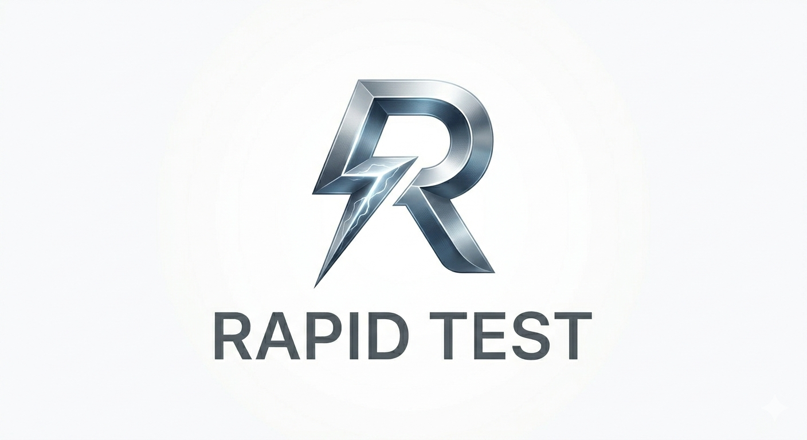

# RapidTest 🚀

A **super lightweight** and fast library to simplify REST API testing. Designed to be intuitive and fast to implement.

## ✨ Features

- **ASGI Testing** - Test FastAPI/Starlette apps directly without HTTP server
- **HTTP Testing** - Test external APIs with `GET`, `POST`, `PUT`, `PATCH`, `DELETE`
- Built-in response validation (status, JSON body, required keys)
- Fake data generation with Faker
- Performance testing with concurrent users (`threading` + `requests`)
- Test any endpoint with just one line of code

## Why RapidTest?

RapidTest eliminates the complexity of REST API testing by providing a simple, intuitive interface that requires minimal setup. Whether you're testing a small microservice or a large API, RapidTest adapts to your needs.

## Key Benefits

!!! info "Developer Friendly" 
    Intuitive API design means you can start testing in minutes, not hours.

!!! tip "Comprehensive"
    From simple GET requests to complex performance testing - all in one package.
    

## Ready to Get Started?

Check out our [Installation Guide](begin/installation.md) to begin using RapidTest in your projects.